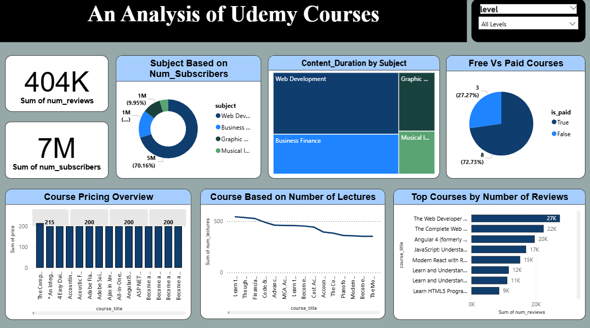

Udemy Course Analysis Dashboard

This project is a Power BI dashboard built to analyze Udemy course data. It provides insights into course pricing, popularity, number of subscribers, and reviews across different categories.

Tools Used
- Power BI
- Udemy Dataset (CSV)

Key Insights
- KPI cards show total subscribers and reviews.
- A vertical bar chart shows price overview of top courses.
- A horizontal bar chart highlights top-reviewed courses.
- Pie charts and slicers allow filtering by category, level, and other fields.
